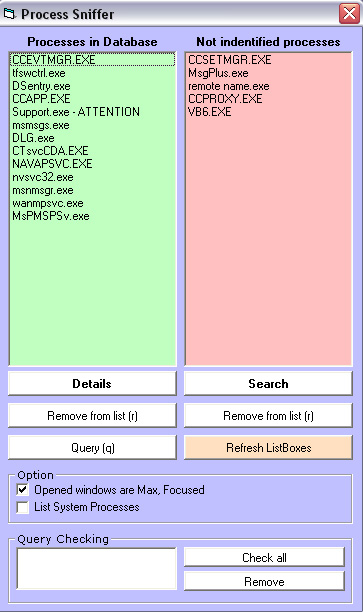



## \[Process Sniffer\]

### Description

This program lists all processes on computer and sorts them into listboxes depending on their detailed information. If it is available, you can also check detail info on a particular process, search for not-found processes. This application is meant to act like a Virus/Spyware/Adware protection that alerts you on common viruses etc. It automatically scans all your processes and matches them with the ones in database and those that are recorded as Spyware / Viruses etc, they are highlited with comment after the process name saying - ATTENTION

This code is not fixing any viruses, spywares etc, it is only identifing the problem. The next step of removal is upon you. Enjoy & vote!
 
### More Info
 

             |
---                |---
**Submitted On**   |2004-05-14 16:52:52
**By**             |[Mephisto](https://github.com/Planet-Source-Code/PSCIndex/blob/master/ByAuthor/mephisto.md)
**Level**          |Advanced
**User Rating**    |4.3 (43 globes from 10 users)
**Compatibility**  |VB 6\.0
**Category**       |[Complete Applications](https://github.com/Planet-Source-Code/PSCIndex/blob/master/ByCategory/complete-applications__1-27.md)
**World**          |[Visual Basic](https://github.com/Planet-Source-Code/PSCIndex/blob/master/ByWorld/visual-basic.md)
**Archive File**   |[\[Process\_S1745555142004\.zip](https://github.com/Planet-Source-Code/mephisto-process-sniffer__1-53794/archive/master.zip)

